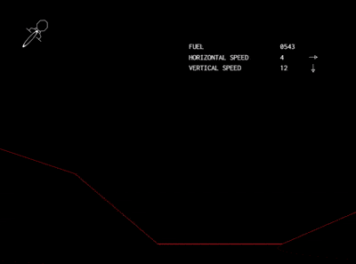
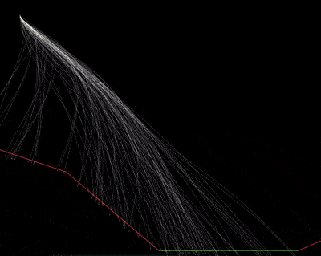

# Mars Lander Genetic Algorithm Simulator 🚀 🧬

 

## The Mars Lander Challenge: A Test of Precision 🔴

The [Mars Lander challenge on CodinGame](https://www.codingame.com/ide/puzzle/mars-lander-episode-2) tasks you with a critical mission: safely land a spacecraft on the Martian surface. This isn't just any landing; it requires precise control over the lander's rotation and thrust to navigate treacherous terrain and touch down gently.

### Mission Objectives:

Your program must guide the Mars Lander capsule, carrying the Opportunity rover, to a successful landing. This involves:

- **Navigating a 2D Environment:** The simulation takes place in a 7000m wide by 3000m high area.
- **Finding the Landing Zone:** A single flat area, at least 1000m wide, exists on the Martian surface. This is your target.
- **Controlling the Lander:** Every second, your algorithm receives telemetry (position, speed, fuel, angle, power) and must output:
  - **Rotation Angle:** Between -90° and 90°.
  - **Thrust Power:** Between 0 (off) and 4 (maximum).
- **Managing Physics:**
  - Mars gravity: 3.711 m/s².
  - Thrust: Power X generates X m/s² thrust and consumes X fuel. A thrust of 4 is needed to counteract gravity.
  - No atmosphere: No air resistance.
- **Achieving a Safe Landing:**
  - Land on the flat ground.
  - Lander must be vertical (0° angle).
  - Vertical speed: ≤ 40 m/s (absolute).
  - Horizontal speed: ≤ 20 m/s (absolute).

The challenge mirrors real-world space exploration problems, demanding a robust solution to handle varying conditions and limited resources.

## Genetic Algorithms: Evolving a Solution for Mars Lander 🧪🧬


This simulator employs a Genetic Algorithm (GA) to discover optimal landing strategies for the Mars Lander. GAs are powerful optimization techniques inspired by natural selection.

### How Genetic Algorithms Work:

1. **Initial Population**: A diverse set of potential solutions (sequences of lander commands) is randomly generated. Each solution is an "individual" with its own "DNA."
2. **Fitness Evaluation**: Each individual's command sequence is simulated. The "fitness" of a solution is determined by how well it performs the landing, considering factors like:
   - Proximity to the designated landing zone.
   - Final vertical and horizontal speeds.
   - Final angle of the lander.
   - Whether it crashed or landed successfully.
   - Fuel efficiency (optional, but good for optimization).
3. **Selection**: Individuals with higher fitness scores (better landings) are more likely to be selected as "parents" for the next generation. This project supports multiple selection strategies:
   - Tournament selection
   - Roulette wheel selection
   - Elitist selection (ensuring the best individuals survive)
4. **Crossover (Recombination)**: "Parent" solutions exchange parts of their DNA (command sequences) to create "offspring." This combines promising traits from successful individuals.
5. **Mutation**: Small, random changes are introduced into the offspring's DNA. This maintains genetic diversity and helps explore new solution possibilities, preventing premature convergence to sub-optimal solutions.
6. **New Generation**: The offspring, potentially along with some elite individuals from the previous generation, form the new population.
7. **Repeat**: This cycle of evaluation, selection, crossover, and mutation repeats for a set number of generations, or until a satisfactory solution is found. Over time, the population evolves towards increasingly better landing strategies.

### Simulator Implementation:

This project applies these GA principles as follows:

- **DNA Representation**: Each individual solution (or "chromosome") in the GA encodes a sequence of `(rotation, thrust)` commands for the lander over a predefined number of game turns.
- **Fitness Function**: The success of a landing is quantified by a fitness score. This score considers:
  - Successful landing on the target zone.
  - Final speeds (vertical and horizontal) within safe limits.
  - Final lander angle (must be 0°).
  - Penalties for crashing or missing the landing zone.
  - Distance to the landing zone if not landed.
  - Remaining fuel can also be a factor.
- **Evolutionary Process**: The GA iteratively refines populations of these command sequences, aiming to find one that results in a perfect landing.
- **Visualization**: A web-based interface allows you to observe the simulation, showing how solutions improve across generations and how the lander behaves with the evolved command sequences.

### Technical Stack:

- **Core Simulation Engine**: Written in **Rust** for its performance and safety, crucial for running many simulations quickly.
- **WebAssembly (WASM)**: The Rust core is compiled to WASM, enabling it to run efficiently in modern web browsers.
- **Interactive Frontend**: Built with **HTML, CSS, and JavaScript** for user interaction, parameter tuning, and visualization of the GA's progress and lander trajectories.
- **Configurable Terrains**: Test your GA against multiple pre-defined Martian surface configurations.

## Getting Started 🚀

### Running the Simulator 💻

1. Build the Rust WASM:
   ```sh
   wasm-pack build --release --target web
   ```

2. Run a local server:
   ```sh
   python3 -m http.server
   ```

3. Open your browser and navigate to:
   ```
   http://localhost:8000/
   ```

4. Test performances
    ```
    cargo test --release -- --nocapture test_perfs
    ```

### Using the Interface 🎮

1. Select a terrain configuration
2. Adjust genetic algorithm parameters:
   - Population size
   - Number of generations
   - Selection method
   - Crossover and mutation rates
3. Click "Run Algorithm" to start the simulation
4. Use the playback controls to visualize the evolution of solutions

## How to Contribute 👥

1. Fork the repository
2. Create a feature branch
3. Add your improvements
4. Submit a pull request

### Support This Project ⭐

- **Found a bug?** [Open an issue](https://github.com/username/mars_lander/issues/new)
- **Like this project?** Give it a star on [GitHub](https://github.com/username/mars_lander)
- **Want to suggest improvements?** [Start a discussion](https://github.com/username/mars_lander/discussions/new)

## License 📝

This project is open-source, feel free to use and modify with attribution.

## Automated Deployment with GitHub Actions 🔄

This repository is configured with a GitHub Action workflow that automatically builds the Rust WASM, minifies the JS, HTML, and CSS, pushes to the `gh-pages` branch, and deploys to GitHub Pages.

### Workflow File

The workflow file is located at `.github/workflows/deploy.yml`.

### How It Works

1. **Build WASM**: The workflow builds the Rust WASM using `wasm-pack build --target web`.
2. **Minify Assets**: The workflow minifies JS, HTML, and CSS using `terser`, `html-minifier`, and `cssnano`, respectively.
3. **Deploy**: The workflow pushes the built and minified files to the `gh-pages` branch and deploys the site to GitHub Pages.

### Triggering the Workflow

The workflow is triggered automatically on every push to the `main` branch.

### Viewing the Deployed Site

The deployed site can be viewed at:
```
https://<your-username>.github.io/<your-repository>/
```
